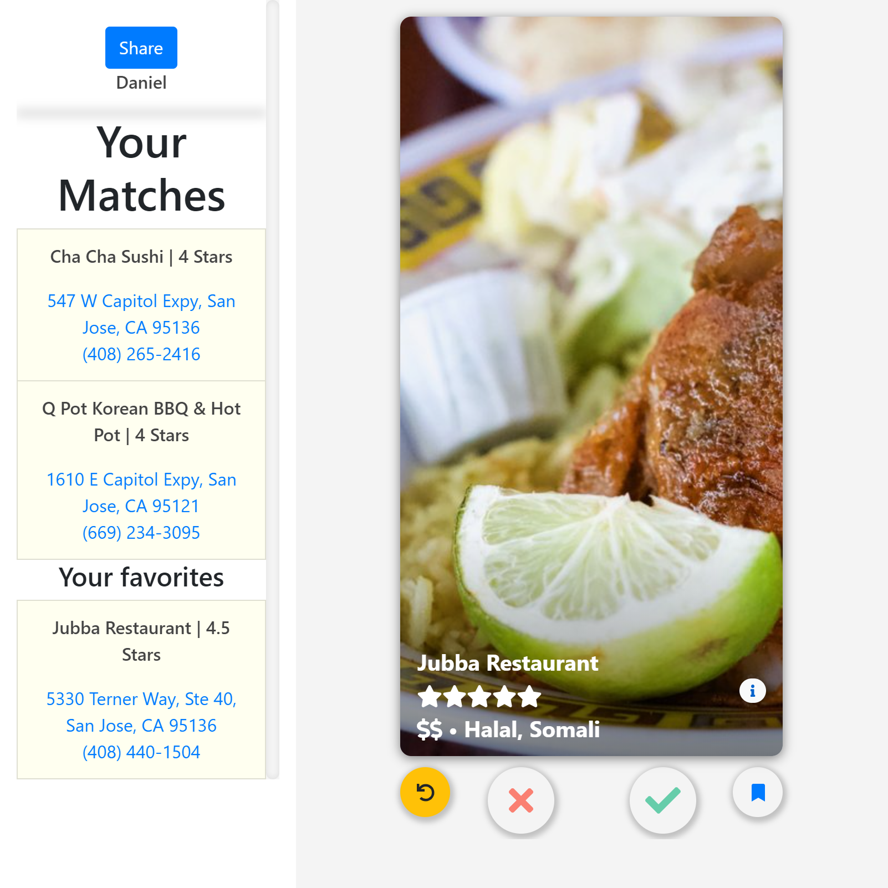

# Chicken Tinder 
  
## Table of Contents
* [Installation](#Installation)
* [Usage](#Usage)
* [Credits](#Credits)
* [Contributing](#Contributing)
* [License](#License)
## Description
```
In order to decide where we will eat as a couple, we can use Chicken Tinder and match with restuarants.
```

[](https://chicken-tinder-00.herokuapp.com/)

## Installation
```npm i```
## Usage
```Upon signing in you can select another user if you are going to hang out with a friend or colleague. If they do not have the app just simply share the link and then create an account.```
## Credits
[ Daniel Vasquez Talavera](https://github.com/DVasquez4155) [ Conrad](https://github.com/ConradRodgers) [ David-Pendley](https://github.com/David-Pendley)
## Contributing
This project has adopted the code of conduct defined by [Contributor Covenant](https://www.contributor-covenant.org/version/2/0/code_of_conduct/).
## License
Licensed under the [MIT License](https://choosealicense.com/licenses/mit/) license.